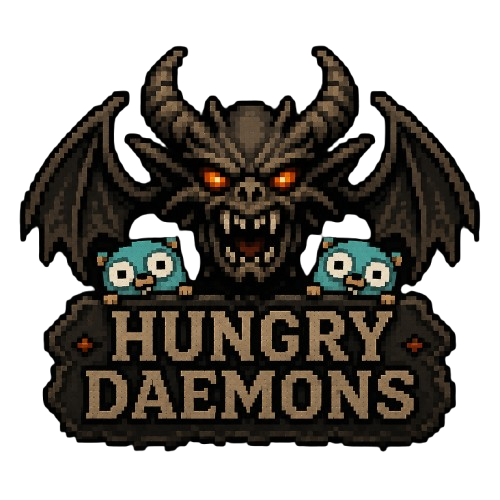
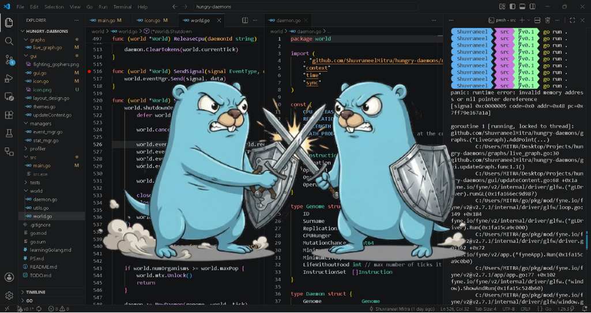

# **Hungry ~Daemons~ Demons**

  

&nbsp;&nbsp;&nbsp;&nbsp;&nbsp;&nbsp;&nbsp;&nbsp;&nbsp;&nbsp;&nbsp;&nbsp;&nbsp;&nbsp; 

`hungry-daemons` is an experimental artificial-life simulator written in Go that models populations of autonomous digital organisms, represented by goroutines, competing for limited computational resources.

Each goroutine is given a "genome", with traits such as:
* CPU hunger
* replication rate
* mutation probability
* starvation tolerance
* resource hold time

**Organism lifecycle:** Organisms request CPU tokens from a shared environment. If they hold the tokens for a minimum amount of time they reproduce with small mutations. These digital "beings" may die of old age or starvation according to configurable evolutionary constraints. 

The project is designed as a sandbox for studying emergent behavior in constrained systems. Small parameter changes can radically alter the evolutionary trajectory of the world.

## Goals

I wanted to learn a new language and chose Golang simply because of the very attractive feature called `goroutines`. I was creating [Conway's Game of Life](https://en.wikipedia.org/wiki/Conway%27s_Game_of_Life) and got hooked to the idea of observing artificial life, ecologies and evolutionary patterns, all inside a simulation. Well, a population needs a lot of organisms to exist simultaenously, and what better way than lightweight goroutines to model this pattern? **This project is currently under active development**, and I am trying to answer some of these questions:

* What kinds of organisms dominate under resource scarcity?
* Can stable ecosystems emerge spontaneously?
* How do mutation rates affect long-term survivability?
* What happens when replication becomes too cheap?

## Current Direction

My vision for this project is much bigger than a simple CPU-token simulation, i.e. to actually starve some goroutines of CPU time and have each goroutine execute a set of x86-64 instructions, which evolve continuously in order to keep surviving competition (and perhaps some sniping!) from its peers. I do want to take a look at integrating:

* Adaptive survival strategies
* More visualization and analytics tooling
* distributed or massively parallel simulation modes
* Right now once the organism acquires CPU tokens it is entirely up to that organism to release it. Future versions may change that.

Relevant Youtube Video: https://www.youtube.com/watch?v=6kiBYjvyojQ
## Building and running the simulation

This project specifically needs `Go >= 1.25`. You can get the latest stable version of Go here: [https://go.dev/doc/install](https://go.dev/doc/install)

- After that, clone the repository: `git clone https://github.com/ShuvraneelMitra/hungry-daemons.git`
- Run `go mod tidy` to synchronize your `go.mod` and `go.sum` files with the source code.
- Move to the `src` directory where `main.go` resides: `cd hungry-daemons/src`
- Run with `go run .`

## Contributing
Right now this project is not accepting contributions, but we should as soon as I can push out a stable release! Till then, here's a fun image (the background is my own IDE while developing this project):

  

